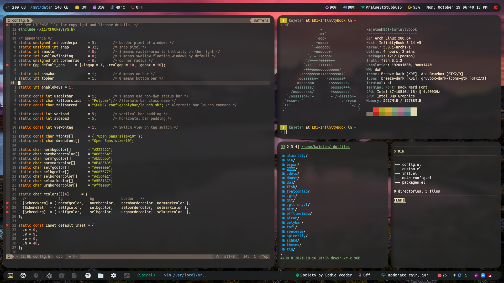

# Kajetan's dotfiles

This repo contains my dotfiles that I use every day on all my main machines.  
They're managed using the excellent [toml-bombadil](https://github.com/oknozor/toml-bombadil).

Feel free to use them if you wish but make sure you look through them first, some may contain hardcoded paths or other quirks.

## Software I use

To be updated...
